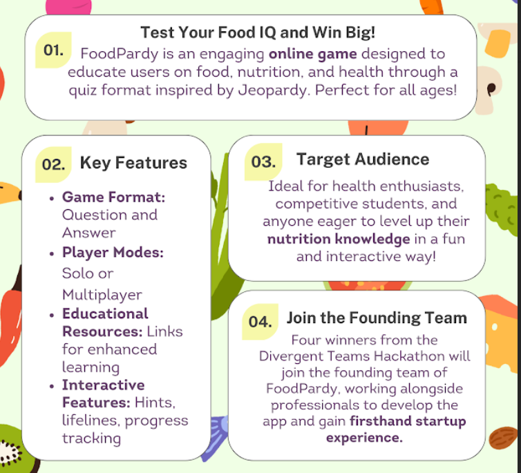

# Goals

- Use AI
- Multiplayer quiz game
- Track exercise or something

# Commands
bun expo install --fix
bun expo start --tunnel

# Remember:
- Remove @react-navigation/stack and instead use @react-navigation/native-stack

# Suggestions
Sanitize input especially the title of the quiz (you can crash the device probably)

# Hosting Backend
Use mongodb or preferably microsoft azure

# Description
01. Added to firststartup.js
Test Your Food IQ and Win Big!
FoodPardy is an engaging online game designed to
educate users on food, nutrition, and health through a
quiz format inspired by Jeopardy. Perfect for all ages!

# Key features
❌Game Format:
Question and
Answer
❌Player Modes:
Solo or
Multiplayer
❌Educational
Resources: Links
for enhanced
learning
❌Interactive
Features: Hints,
lifelines, progress
tracking

Target Audience:
Ideal for health enthusiasts,
competitive students, and
anyone eager to level up their
nutrition knowledge in a fun
and interactive way!

